<h1 align="center">Mori</h1>

<p align="center">
  A web-based spaced repetition system that imports Anki <code>.apkg</code> decks<br>
  and reviews them with <a href="https://github.com/open-spaced-repetition">FSRS</a> scheduling.
</p>

<p align="center"><em>Everything you learn is decaying right now. Mori schedules the argument.</em></p>

<p align="center">
  <a href="https://mori-web-eight.vercel.app"></a>
  
  
</p>

<p align="center">
  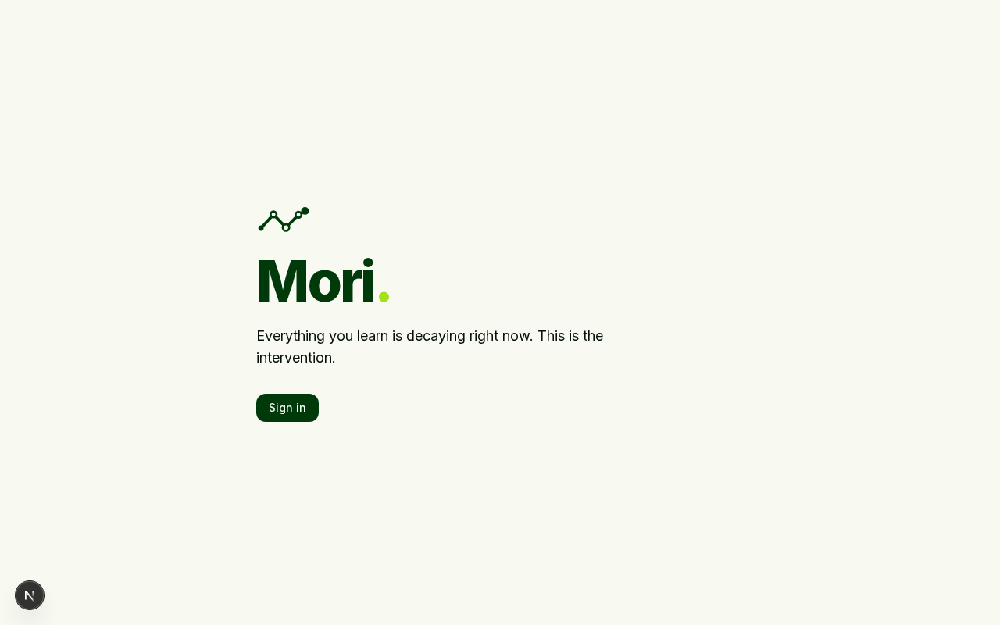
</p>

## What it does

Upload an `.apkg` file exported from Anki, and its notes, note types, card
templates, media, and scheduling history import into your account. Review
on any device — a lab computer, a phone browser, a locked-down work laptop
— with the queue, intervals, and card rendering behaving the way Anki does.

No desktop install. No AnkiWeb account. Just the deck you already have.

## Architecture

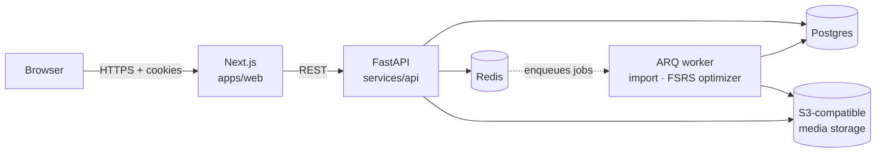

`apps/web` and `packages/renderer` (the Anki template/cloze/LaTeX engine,
dependency-free and unit-tested on its own) share an npm workspace so the
renderer's output stays identical whether it's previewing a card or
actually running a review. `services/api` is async end to end — FastAPI,
SQLAlchemy 2.0, asyncpg — with imports and FSRS parameter tuning running
as ARQ background jobs rather than blocking a request, since a 10,000-card
deck or a 400-review optimization pass both take longer than an HTTP
request should.

## Design system

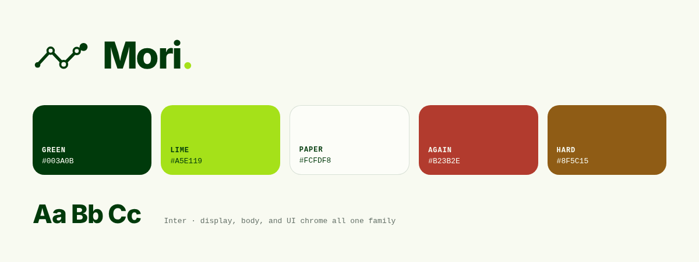

One continuous five-node path forms the mark: entry dot → peak → valley →
peak → terminal dot — hollow nodes read as review checkpoints, solid ones
as entry and reinforced memory. Deep green (`#003A0B`) carries the brand's
weight; lime (`#A5E119`) is reserved as the recall signal — the one
accent color, used for emphasis and the "Easy" rating rather than spread
across the UI. Inter is the only typeface, one family across headlines,
body copy, and UI chrome (self-hosted via `next/font`, not a CDN request).
Rating colors stay four distinct hues rather than collapsing to the
two-color brand palette — legible at a glance mid-review mattered more
than strict on-brand purity, so `apps/web/styles/tokens.css` retunes them
to sit inside the palette instead (`Again` warm red, `Hard` a WCAG-AA-checked
amber, `Good` the brand green, `Easy` the brand lime).

## Screens

<table>
<tr>
<td width="50%">

**Sign in**

Email + password, httpOnly cookie sessions. No third-party auth to wire up
before you can see your own decks.

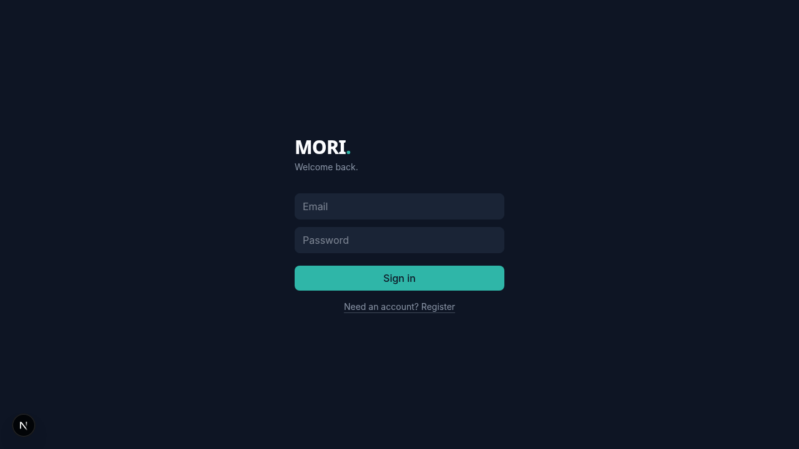

</td>
<td width="50%">

**Decks**

Anki-style `Parent::Child` naming builds the hierarchy for you — type the
full path once, the parents are created automatically if they don't exist.

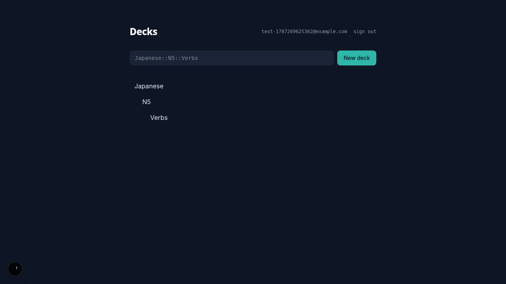

</td>
</tr>
</table>

**Import**

Upload an `.apkg`, watch it stream through a background worker — note
types, notes, cards, and deduped media all land in one pass, with live
progress and a final count.

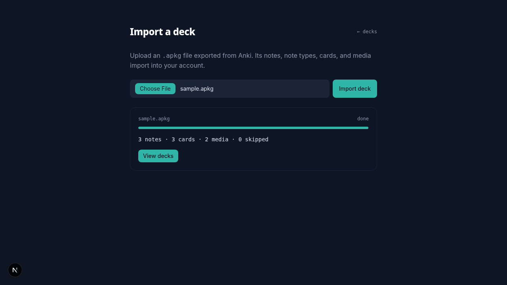

**Rendering**

Anki's template grammar, cloze deletions, and LaTeX — rendered inside a
sandboxed iframe with no script execution allowed, math typeset by KaTeX
in the host page and handed in as static markup.

<table>
<tr>
<td width="50%">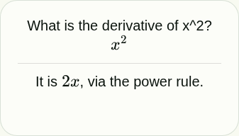</td>
<td width="50%">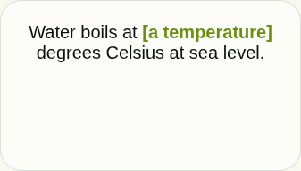</td>
</tr>
</table>

**Review**

The interval ribbon — a log-scale ruler showing where each rating would
land the card, previewed client-side and drawn fresh every reveal. FSRS
scheduling, sibling burying, undo, and keyboard shortcuts throughout.

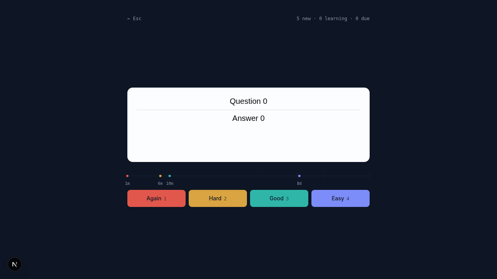

**Stats**

Retention rate, a 30-day review history, and a 30-day due forecast per
deck — so an imported deck's real scheduling maturity is visible, not
just guessed at.

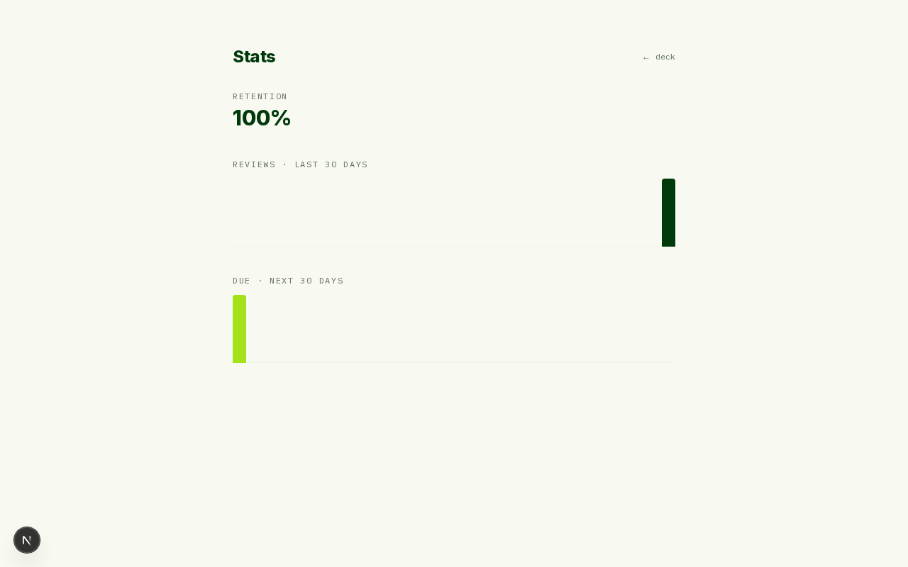

**Offline**

The next 50 cards and their media prefetch into IndexedDB at the start of
a session. Lose the connection mid-review and answers keep landing — each
one buffered locally and replayed the moment you're back, with the same
idempotency key it would have used online, so nothing double-scores and
nothing gets lost.

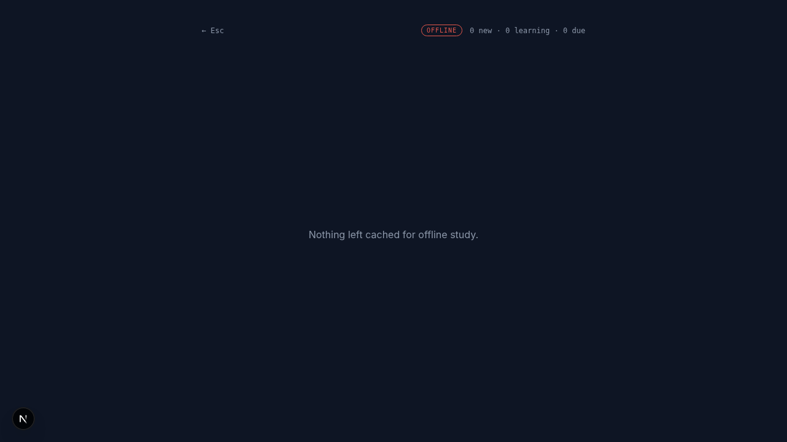

## Status

Early build. Shipped so far:

- [x] Docker Compose skeleton — web, api, worker, db, redis, minio
- [x] Auth — register, login, httpOnly cookie sessions
- [x] Deck CRUD with `Parent::Child` hierarchy
- [x] Legacy `.apkg` import — notes, cards, media, deck hierarchy, background worker with live progress
- [x] Card renderer — templates, filters, conditionals, cloze, media rewriting, LaTeX, sandboxed no-script iframe
- [x] Review loop — FSRS scheduling, queue builder with deck-limit inheritance, sibling burying, undo, keyboard shortcuts, interval ribbon
- [x] FSRS seeding for imported decks + per-deck stats (retention, review history, due forecast)
- [x] Offline support — Dexie prefetch, buffered answers, replay on reconnect
- [x] Modern `.apkg` format (schema v18, zstd, protobuf) + FSRS parameter tuning from review history

## Running it

Requires Docker and Docker Compose.

```sh
docker compose up
```

| Service | URL |
|---|---|
| Web | http://localhost:3010 |
| API | http://localhost:8010 (health check at `/health`) |
| MinIO console | http://localhost:9001 |

Ports are non-default (3010/8010 instead of 3000/8000) to avoid clashing
with other local services; adjust in `docker-compose.yml` if you'd rather
free up the standard ports.

### Deploying

Live at [mori-web-eight.vercel.app](https://mori-web-eight.vercel.app) —
a split deploy across five providers, chosen to run at $0–10/month rather
than the cost of a single all-in-one PaaS:

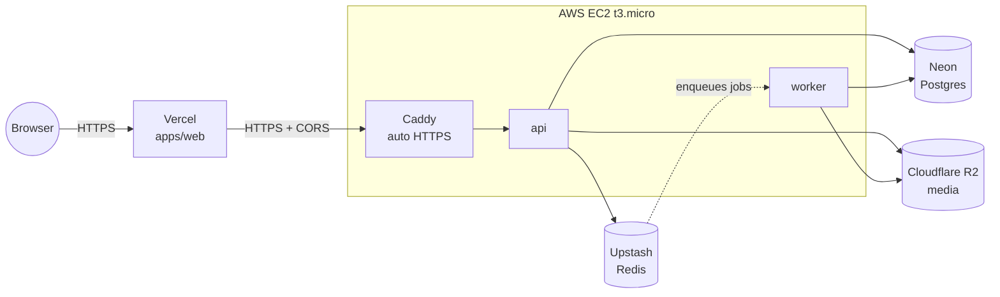

Neon, Upstash, and R2 are free indefinitely at this scale; the compute
piece currently runs on a temporary AWS credit balance rather than a
permanent free tier — Oracle Cloud and GCP both offer a genuinely
indefinite free VM instead, at the cost of their own signup friction
(Oracle's fraud check rejects a fair number of legitimate signups
outright; GCP now requires a one-time prepayment for some new accounts).
`Caddy` handles automatic HTTPS via Let's Encrypt; `api` and `worker` are
the same two Docker images `docker-compose.yml` builds for local dev,
just pointed at managed services (`docker-compose.prod.yml`) instead of
local containers. The production Compose stack runs `alembic upgrade head`
as a one-shot migration service and only starts the API and worker after it
completes successfully, so application code never starts against an older
database schema.

## Development

Frontend (`apps/web`) is Next.js 15 + TypeScript + Tailwind CSS v4, plus a
dependency-free template renderer (`packages/renderer`) shared via npm
workspaces. Backend (`services/api`) is FastAPI + SQLAlchemy (async) +
Alembic on PostgreSQL, with ARQ/Redis for background jobs.

```sh
npm install                      # installs apps/web + packages/renderer together
npm run dev --workspace=apps/web
cd services/api && pip install -e ".[dev]" && uvicorn app.main:app --reload
```

Running the API test suite requires a Postgres instance — the `db` service
exposes one on `localhost:5433` via `docker compose up -d db`. Copy
`services/api/.env.example` to `services/api/.env` to point local tooling
(pytest, alembic, uvicorn run outside Docker) at it.

## Licence

AGPL-3.0-or-later. See [NOTICE.md](NOTICE.md) for the clean-room and
trademark statement.

## What this is not

Not affiliated with or endorsed by Anki. Mori reads `.apkg` deck packages;
it does not sync with AnkiWeb, and no Anki source code is used anywhere in
this project.
